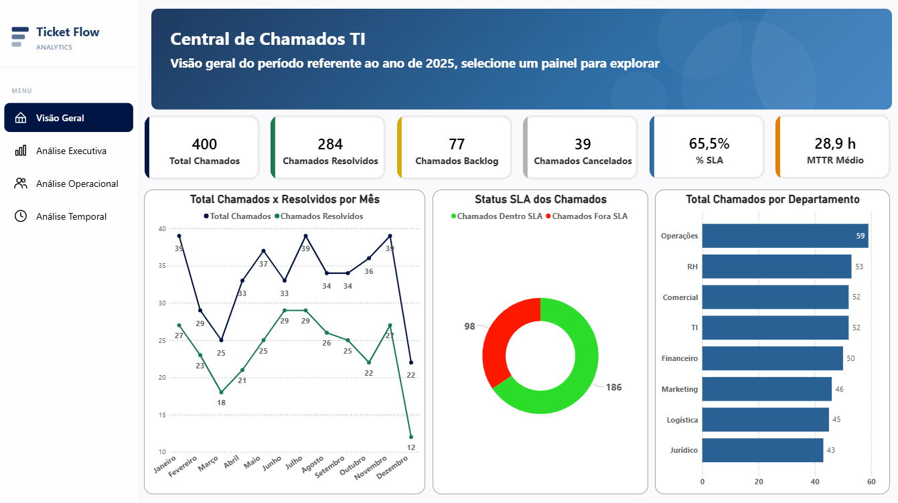

# 📊 Dashboard Ticket-Flow-Analytics — Power BI

## Descrição do Projeto

Dashboard interativo desenvolvido em Power BI para monitoramento e análise da Central de Chamados de TI. O projeto consolida dados do período de 2025 e oferece visões estratégicas, operacionais e temporais sobre o desempenho do suporte técnico, com foco em SLA, MTTR e produtividade da equipe.

A solução foi construída utilizando modelagem dimensional (Star Schema), medidas DAX, dashboards interativos e um menu lateral customizado desenvolvido em HTML para melhorar a navegação entre páginas e proporcionar uma experiência de uso mais intuitiva.

---

# 🎯 Objetivos da Análise

O projeto foi desenvolvido com os seguintes objetivos:

* Monitorar a conformidade com os acordos de nível de serviço (SLA) por prioridade
* Avaliar o desempenho individual e coletivo da equipe técnica
* Identificar padrões de demanda por turno, dia da semana e mês
* Apoiar a tomada de decisão estratégica com indicadores consolidados
* Mapear gargalos operacionais por categoria, canal e departamento

---

# ❓ Perguntas de Negócio Respondidas

O dashboard permite responder perguntas como:

* Qual o percentual de chamados resolvidos dentro do prazo do SLA?
* Em quais prioridades o SLA está mais crítico em relação à meta?
* Qual técnico possui melhor desempenho em volume de resolução e SLA?
* Existe diferença de MTTR entre técnicos Júnior, Pleno e Sênior?
* Em qual turno e dia da semana a demanda de chamados é mais alta?
* Quais categorias de chamado têm maior volume e pior conformidade de SLA?
* Qual departamento gera mais chamados para o suporte técnico?
* Qual a proporção de chamados nos fins de semana vs dias úteis?

---

# 🔍 Principais Insights

Durante a análise foi possível identificar:

* SLA abaixo da meta em todas as prioridades, nenhuma prioridade atingiu a meta de 85%, com destaque para Baixa (57,1%) e Alta (64,7%)
* Noite e Madrugada concentram mais chamados, os dois turnos respondem por mais de 50% do volume total, indicando necessidade de reforço fora do horário comercial
* Segunda-feira é o dia de maior demanda, 67 chamados contra 50 nas quartas e terças, pico típico de início de semana
* Dezembro registra o pior MTTR, 52,5h de média, contra 18,1h em setembro, possivelmente impactado por férias e redução de equipe
* 71% dos chamados são resolvidos, mas o backlog ativo de 77 chamados e 25 reaberturas indicam oportunidade de melhoria na qualidade
* Sênior tem MTTR mais alto (32h) que Júnior (23,7h), sugerindo que recebem casos de maior complexidade
* Backup/Dados é a categoria com maior volume (75 chamados) e melhor SLA (72,4%), enquanto E-mail tem o pior SLA (54,2%)
* 28,5% dos chamados ocorrem no fim de semana, volume relevante para avaliar necessidade de plantão

---

# 🛠️ Ferramentas Utilizadas

* Power BI (Visualização e criação de dashboards interativos)
* Power Query (Transformação e limpeza dos dados)
* DAX (Cálculo de medidas, inteligência de tempo e variações)
* Excel (Análise exploratória, tratamento de dados e apoio na modelagem)
* HTML + CSS (Menu lateral interativo via visual HTML Content)

---

# 📈 Principais Indicadores

## KPIs Gerais

* Total de Chamados
* Chamados Resolvidos
* Chamados Abertos
* Chamados Em Atendimento
* Chamados Pendentes
* Chamados Reabertos
* Chamados Backlog

## Indicadores Percentuais

* % Abertos
* % Cancelados
* % Resolvidos
* % Em Atendimento
* % Pendentes
* % Reabertos

## Indicadores de SLA e Performance

* % SLA
* Chamados Dentro SLA
* Chamados Fora SLA
* SLA Gap
* MTTR (Tempo Médio de Resolução)

---

# 📊 Análises Desenvolvidas

## Visão Geral

Apresenta indicadores consolidados e visão estratégica da operação com os 6 principais KPIs e 3 gráficos resumidos. Ponto de entrada para navegação pelo dashboard.

* Evolução Mensal;
* Distribuição de SLA; 
* Volume por Departamento.

---

## Análise Executiva

Foco estratégico em SLA e qualidade com KPIs de percentual e gap para leitura executiva.

* Inclui Tendência de SLA vs Meta mensal;
* Conformidade SLA por Prioridade;
* Distribuição por Status;
* Tabela de Volume e SLA por Categoria;

---

## Análise Operacional

Foco em produtividade, eficiência e distribuição operacional.

* Tabela ranking de técnicos com Volume, Chamados Resolvidos e SLA %;  
* Gráfico de Carga de Trabalho por Status e por técnico;
* MTTR comparativo por nível de senioridade.

---

## Análise Temporal

Foco em comportamento temporal e sazonalidade. Base para decisões de escala e dimensionamento de equipe.

* Distribuição por Turno
* Chamados por dia da semana
* Evolução temporal do MTTR
* Comparativo entre dias úteis e finais de semana

---

# 📁 Estrutura do Projeto

```text
data/
│
├── Base_Suporte_Tecnico.xlsx
│

powerbi/
│
├── Ticket-Flow-Analytics.pbix
│

docs/
│
├── Documentacao_Projeto.pdf
├── Guia_Usuario.pdf
│

README.md
```

---

# 📌 Contexto

Os dados utilizados neste projeto são fictícios, gerados para fins acadêmicos e de portfólio. A base simula o registro de chamados de uma Central de Suporte de TI ao longo de 2025, contendo informações sobre técnicos, categorias, canais, prioridades, status e tempos de atendimento.

O modelo semântico foi construído seguindo o padrão estrela com uma tabela fato (Fato_Chamados), três dimensões (Dim_Calendario, Dim_Tecnicos, Dim_SLA_Config) e uma tabela auxiliar (Dim_Turno). As 21 medidas DAX foram organizadas em pastas de exibição e documentadas com comentários inline.

O objetivo principal foi transformar dados operacionais em informações úteis para acompanhamento de desempenho e suporte à tomada de decisão.

---

# 🖼️ Preview do Dashboard

